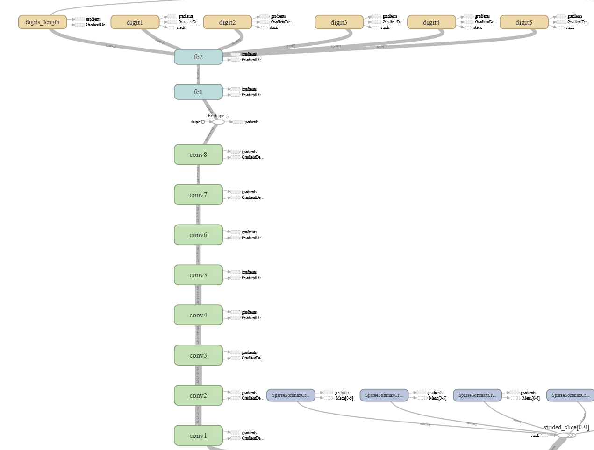

# NumberCamera #
**Goal**: Develop an application based on Pytorch to recognize numbers in images with cameras in real time.

**Source**:[Multi-digit Number Recognition from Street View Imagery using Deep Convolutional Neural Networks](https://arxiv.org/pdf/1312.6082.pdf)

## Requirements ##
1. Python 3.6
2. Pytorch
3. h5py

        In Windows:
        > pip3 install h5py
        In Ubuntu:
		$ sudo pip3 install h5py

4. Pillow, matplotlib etc.
5. Street dataset 

    >View House Numbers (SVHN [http://ufldl.stanford.edu/housenumbers/](http://ufldl.stanford.edu/housenumbers/))
## Results ##
### Graph ###
</img>
